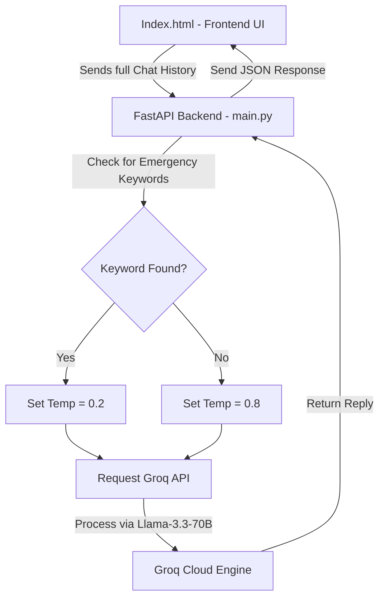

# 🩺 E-Clinix: Premium AI Medical Consultant Portal

E-Clinix is a state-of-the-art, premium AI-powered Telemedicine Portal. It integrates a lightweight, fast **FastAPI** backend with a modern, glassmorphic **HTML5/Vanilla CSS** frontend. The AI capability is powered by the **Llama 3.3 70B** model via the high-performance **Groq API**.

---

## 🌟 Key Features

* **🧠 Conversational Chat Memory:** Preserves complete conversation history on the client side, allowing context-aware follow-up answers from the AI.
* **⚡ Safety Precision Core (Dynamic Temperature):**
  * **Emergency / Precise Mode (Temp: 0.2):** Automatically triggers when severe keywords (e.g., *chest pain*, *bleeding*, *dosage*, *emergency*) are detected, ensuring high safety, clinical precision, and urgent guidance to seek real medical help.
  * **Friendly / Casual Mode (Temp: 0.8):** Active for everyday wellness queries, offering supportive, empathetic, and casual health conversations.
* **🎨 Premium Glassmorphism UI:** Designed with Outfit and Plus Jakarta Sans typography, soft gradient backgrounds, animated glow rings, real-time diagnostic status pulses, and modern hover transitions.
* **📱 Fully Responsive:** Beautifully optimized dashboard layout across desktop, tablet, and mobile views.
* **📋 Direct Copy Utilities:** One-click clipboard copy buttons for doctor's suggestions.

---

## 🏗️ Architecture & Data Flow



---

## 📁 Repository Structure

```text
Medical-Consultant/
│
├── .venv/                  # Python Virtual Environment
├── .env                    # Secret Environment variables (API Keys)
├── .gitignore              # Files/directories excluded from Git
├── Index.html              # Frontend user interface (HTML, CSS, JS)
├── main.py                 # Backend FastAPI router & Groq API handler
├── schemas.py              # Pydantic data validation schemas
├── run_server.bat          # Easy double-click startup batch script
└── README.md               # Project documentation
```

---

## 🚀 Setup & Getting Started

### 1. Prerequisites
Ensure you have **Python 3.10+** installed on your system.

### 2. Configure Credentials
Create a file named `.env` in the root folder (this is already ignored by git to keep your key secure) and paste your Groq API Key:
```env
GROQ_API_KEY=your_actual_groq_api_key_here
```

### 2b. Supabase Google Login Setup
If you want the separate Google login page, create a Supabase project and add your site URL in the Auth settings.

Use these values in `Login.html`:
```text
SUPABASE_URL = your_supabase_project_url
SUPABASE_ANON_KEY = your_supabase_anon_key
```

In Supabase dashboard:
1. Go to **Authentication > Providers > Google** and enable Google.
2. Add your Google OAuth credentials.
3. Add redirect URLs like `http://127.0.0.1:8000/login` and your deployed domain.
4. Keep the chat app route separate from the login page.

### 3. Launching the Application
#### Windows (Recommended):
Simply double-click the **`run_server.bat`** file. It will automatically activate the Python virtual environment and run the server.

#### Manual Startup (Terminal):
```bash
# 1. Activate Virtual Environment
.venv\Scripts\activate

# 2. Run the Server
python -m uvicorn main:app --reload --port 8000
```

Once running, visit **[http://127.0.0.1:8000](http://127.0.0.1:8000)** for login and **[http://127.0.0.1:8000/chat](http://127.0.0.1:8000/chat)** for the chat app.

---

## ⚠️ Important Medical Disclaimer
This portal is built solely for informational, general health, and wellness consultation. It is **not** a replacement for professional clinical advice, diagnosis, or treatment. Under severe conditions or emergencies, users must consult a licensed medical doctor or contact local emergency services immediately.
