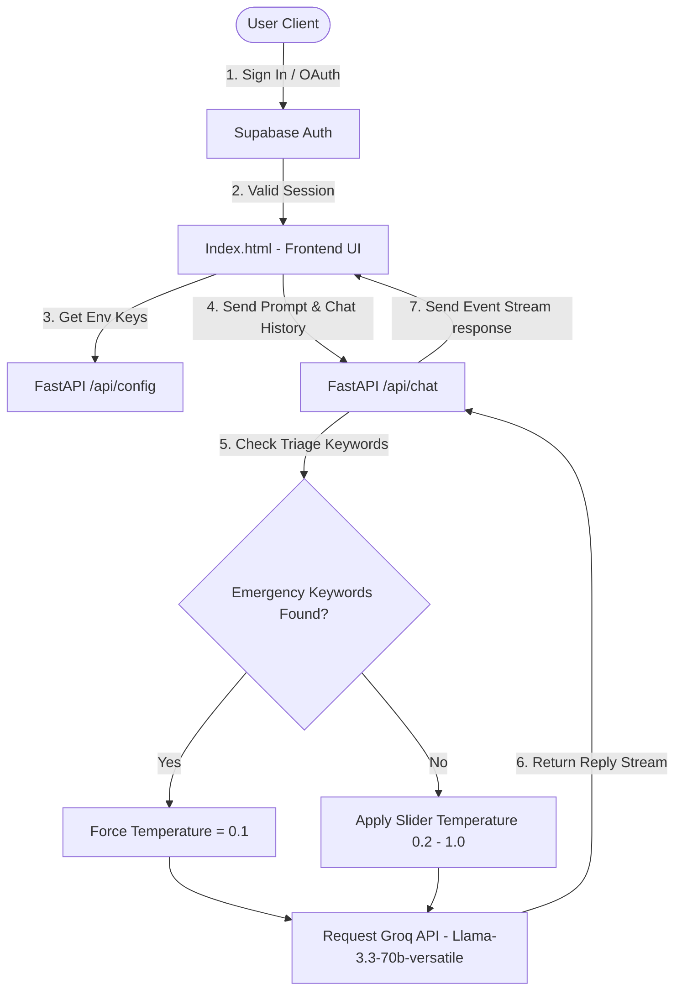

# 🩺 E-Clinix: Premium AI Medical Consultant Portal

E-Clinix is a state-of-the-art, premium AI-powered Telemedicine Portal. It integrates a lightweight, fast **FastAPI** backend with a modern, glassmorphic **Tailwind CSS/HTML5** frontend. The AI capability is powered by the **Llama 3.3 70B** model via the high-performance **Groq API**, backed by **Supabase Auth** for secure user access management.

---

## 🌟 Key Features

* **🔐 Multi-Method Authentication (Supabase Auth):**
  * **Native Credentials:** Secure Email/Password SignUp, LogIn, and Forgot Password features with confirmation verification screens.
  * **Social LogIn:** "Continue with Google" OAuth authentication.
  * **Automatic Session Guards:** Automatic verification of active session tokens on chat entry, auto-login persistence, and seamless redirects.
* **🧠 Conversational Chat Memory:** Preserves complete conversation history on the client side and persists sessions via Supabase database, allowing context-aware follow-up answers from the AI.
* **⚡ Safety Precision Core (Dynamic Temperature):**
  * **Clinical Triage / Precise Mode (Temp: 0.1):** Auto-triggers when severe or critical keywords (e.g., *chest pain*, *bleeding*, *dosage*, *emergency*) are detected, ensuring high safety, clinical precision, and urgent guidance to seek real medical help.
  * **Normal / Empathetic Mode (Temp: 0.2 - 1.0):** Adjustable via a frontend slider to dial in the response temperature for general wellness queries.
* **🎨 Premium Healthcare Aesthetics:** 
  * Outfit and Plus Jakarta Sans typography, soft gradient backgrounds, animated glow rings, real-time diagnostic status pulses, and modern hover transitions.
  * Sleek glassmorphic chat input bar and optimized dark mode contrast adjustments.
  * Custom Base64-encoded SVG stethoscope favicon dynamically responsive across light and dark browser tabs.
  * Native CSS Variable-driven typing indicators (three bouncing dots) adapting seamlessly to light/dark themes.
* **🌗 Persistent Theme Engine:** Complete toggleable support for Light and Dark modes. The theme preference is stored in `localStorage` and initialized inline to eliminate screen flashing.
* **👤 Dynamic Avatars:** Auto-generated user avatars displaying the user's name initial across the chat window and session history panel.
* **✍️ Smooth Typewriter Streaming:** Utilizes a decoupled frontend queue buffer with dynamic-speed catch-up, delivering an ultra-smooth, character-by-character response effect (similar to ChatGPT/Gemini).
* **📱 Fully Responsive:** Beautifully optimized dashboard layout across desktop, tablet, and mobile views.
* **📋 Direct Copy Utilities:** One-click clipboard copy buttons for doctor's suggestions.
* **🔒 Hardened Security Core:** 
  * AI system prompt secured against jailbreaks, DAN-mode persona bypasses, system instruction leaks, and domain scope creep.
  * Zero hardcoded frontend credentials: API configurations (Supabase URL, Anon Key) are served dynamically from the backend environment.
* **📂 Local Static Asset Serving:** Backend server configured to directly serve files like the doctor avatar (`doctor.png`) securely.

---

## 🏗️ Architecture & Data Flow



---

## 📁 Repository Structure

```text
Medical-Consultant/
│
├── .venv/                  # Python Virtual Environment
├── .env                    # Secret Environment variables (API Keys, Supabase URLs)
├── .gitignore              # Files/directories excluded from Git
├── Index.html              # Main chat application dashboard interface
├── Login.html              # Redesigned split-column auth portal (Login/Signup/Forgot Password)
├── main.py                 # FastAPI backend router, SSE streamer & static file handler
├── schemas.py              # Pydantic data validation schemas
├── requirements.txt        # Python library dependencies
├── doctor.png              # Doctor avatar profile image
├── security_report.md      # Security & Red-Teaming vulnerabilities report
├── run_server.bat          # Easy double-click startup batch script
├── vercel.json             # Vercel serverless functions and routing configs
└── README.md               # Project documentation (Updated)
```

---

## 🚀 Setup & Getting Started

### 1. Prerequisites
Ensure you have **Python 3.10+** installed on your system.

### 2. Configure Credentials
Create a file named `.env` in the root folder (already ignored by Git to keep your credentials secure) and populate it with your keys:
```env
GROQ_API_KEY=your_actual_groq_api_key_here
SUPABASE_URL=your_supabase_project_url
SUPABASE_ANON_KEY=your_supabase_anon_key
```

### 3. Supabase Configuration
To enable native and Google authentication:
1. In the Supabase Dashboard, navigate to **Authentication > Providers > Google** and enable Google.
2. Provide your Google OAuth Client ID and Secret.
3. Configure Redirect URLs under authentication settings (e.g., add `http://127.0.0.1:8000/login` and your production domain).
4. Create the required database tables (`Chat Sessions` and `Messages`) with standard schema columns to allow session storage.

### 4. Launching the Application
#### Windows (Recommended):
Simply double-click the **`run_server.bat`** file. It automatically activates the Python virtual environment and starts the FastAPI server.

#### Manual Startup (Terminal):
```bash
# 1. Activate Virtual Environment
.venv\Scripts\activate

# 2. Run the Server
python -m uvicorn main:app --reload --port 8000
```

Once running, visit **[http://127.0.0.1:8000](http://127.0.0.1:8000)** to sign in, which will redirect you to **[http://127.0.0.1:8000/chat](http://127.0.0.1:8000/chat)** upon successful login.

---

## ⚠️ Important Medical Disclaimer
This portal is built solely for informational, general health, and wellness consultation. It is **not** a replacement for professional clinical advice, diagnosis, or treatment. Under severe conditions or emergencies, users must consult a licensed medical doctor or contact local emergency services immediately.
